# 一、单选题

1.  {width="2.385in"
    height="1.2716666666666667in"}如图所示，在同一平台上的 *O*
    点水平抛出的三个物体，分别落到 *a*、*b*、*c*
    三点，不计空气阻力，则三个物体运动的初速度 *va*、*vb*、*vc*
    的关系和三个物体运动的时间 *ta*、*tb*、*tc* 的关系分别是（ ）

    A.  *va*\>*vb*\>*vc*；*ta*\>*tb*\>*tc* B.
        *va*\<*vb*\<*vc*；*ta*＝*tb*＝*tc*

> C. *va*\<*vb*\<*vc*； *ta*\>*tb*\>*tc* D.
> *va*\>*vb*\>*vc*；*ta*\<*tb*\<*tc*

【答案】C

【解析】

【详解】由自由落体运动的位移公式

> *h* = 1 *gt* ^2^
>
> 2

*ha* \> *hb* \> *hc*

解得

> *ta* \> *tb* \> *tc*

假设三个物体下落相同高度时，则水平射程不同

> *ha* = *hb* = *hc xa* \< *xb* \< *xc*
>
> 2*h*
>
> *g*
>
> *x* = *v*
>
> 0

解得

> *va* \< *vb* \< *vc*

C 正确，ABD 错误。故选 C。

2.  质谱仪的原理如图所示，虚线 *AD*
    上方区域处在垂直纸面向外的匀强磁场中，*C*、*D*
    间有一荧光屏。同位素离子源产生 *a*、*b*
    两种电荷量相同的离子，无初速度进入加速电场，经同一电压加速后，垂直进入磁场，

*a* 离子恰好打在荧光屏 *C* 点，*b* 离子恰好打在 *D*
点。离子重力不计。则（ ）

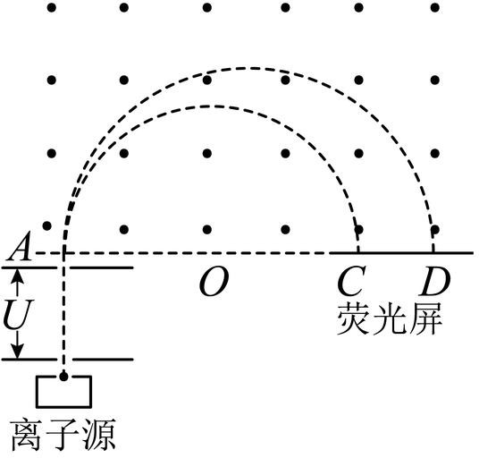{width="2.9126771653543306in"
height="2.7733333333333334in"}

A.  *a* 离子质量比 *b* 的大 B. *a* 离子质量比 *b* 的小

C. *a* 离子在磁场中的运动时间比 *b* 的长 D. *a*、*b*
离子在磁场中的运动时间相等

【答案】B

【解析】

【分析】

【详解】AB．设离子进入磁场的速度为 *v*，在电场中

> *qU* = 1 *mv*2

# 2

在磁场中

> *qvB* = *m v*

2

### r

联立解得

> *r* =
>
> 1 2*mU*
>
> *B q*

由题图知，*b* 离子在磁场中运动的轨道半径较大，*a*、*b*
为同位素，电荷量相同，所以 *b* 离子的质量大于 *a*

离子的质量，A 错误，B 正确；

CD．在磁场中运动的时间均为半个周期，即

> *t* = *T* = π*m*
>
> 2 *Bq*

由于 *b* 离子的质量大于 *a* 离子的质量，故 *b*
离子在磁场中运动的时间较长，CD 错误。故选 B。

3.  如图所示，倾角为*θ*的斜面体 *c* 置于水平地面上，小物块 *b*
    置于斜面上，通过细绳跨过光滑的定滑轮与沙漏 *a* 连接，连接 *b*
    的一段细绳与斜面平行．在 *a* 中的沙子缓慢流出的过程中，*a*、*b*、*c*
    都处于静止状态，则

> （ ）

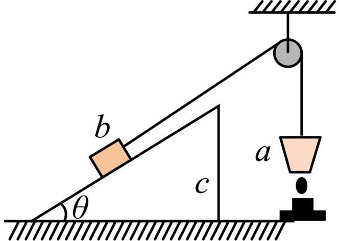{width="1.5446117672790902in"
height="1.0816666666666668in"}

A.  *c* 对 *b* 的支持力一定减小

B.  *b* 对 *c* 的摩擦力一定减小

C.  地面对 *c* 的摩擦力方向可能向右

D.  地面对 *c* 的摩擦力一定减小

【答案】D

【解析】

【详解】A．由小物块 *b* 垂直斜面方向受力平衡可知，*c* 对 *b*
的支持力一直等于 *b* 的重力垂直斜面向下的分力，因 *b* 的质量不变，所以
*c* 对 *b* 的支持力不变，故 A 错误；

> B．细绳上的拉力大小等于 *a* 的重力，若初始状态细绳上的拉力大于 *b*
> 的重力沿斜面向下的分力，则根据小物块 *b* 沿斜面方向受力平衡得 *ma g* =
> *mb g* sinθ+ *F*f
>
> 即 *F*f = *ma g* − *mb g* sinθ
>
> 所以随着 *a* 中的沙子缓慢流出 *F*~f~ 减小，根据牛顿第三定律，*b* 对
> *c* 的摩擦力也减小；若初始状态细绳上的拉力小于 *b*
> 的重力沿斜面向下的分力，则根据小物块 *b* 沿斜面方向受力平衡得 *ma g* +
> *F*f = *mb g* sinθ
>
> 即 *F*f = *mb g* sinθ− *ma g*

所以随着 *a* 中的沙子缓慢流出 *F*~f~ 增大，根据牛顿第三定律，*b* 对 *c*
的摩擦力也增大，故 B 错误；

CD．将小物块 *b* 和斜面体 *c* 看作整体，由水平方向受力平衡可知，地面对
*c* 的摩擦力与细绳拉力的水平分力等大反向，所以地面对 *c*
的摩擦力方向向左，又由于随着 *a*
中的沙子缓慢流出细绳上的拉力逐渐减小，所以地面对 *c*
的摩擦力一定减小，故 C 错误，D 正确。

故选 D。

4.  一物体静止在地面上，在竖直方向的拉力作用下开始运动（不计空气阻力）。在向上运动的过程中，物体的机械能
    *E* 与上升高度 *h* 的关系图象如图所示，其中 0 \~ *h*1
    过程的图线是过原点的直线，*h*1 \~ *h*2
    过程的图线为平行于横轴的直线。则（ ）

> 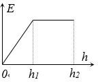{width="1.2006255468066491in"
> height="1.0in"}

A.  在 0 \~ *h*2 上升过程中，物体先做加速运动，后做匀速运动

B.  在 0 \~ *h*1 上升过程中，物体的加速度不断增大

C.  在 0 \~ *h*l 上升过程中，拉力的功率保持不变

D.  在 *h*1 \~ *h*2 上升过程中，物体只受重力作用

【答案】D

【解析】

【详解】ABD．物体静止在地面上，在竖直方向的拉力和重力作用下向上开始运动，根据功能关系可知，除重力之外的拉力做功改变物体的机械能，故
*E* − *h* 图象斜率表示所受拉力的大小，在0～*h*1 上升过程中， *E*
随上升高度 *h* 均匀增大，则 *E* − *h*
图象斜率不变，则拉力大小不变，根据牛顿第二定律有 *F* − *mg* = *ma*

> 可知物体的加速度不变，则此过程物体做匀加速运动；在 *h*1～*h*2
> 上升过程中，*E* 随上升高度 *h* 不变，则 *E* − *h*

图象斜率为零，则拉力大小为零，物体只受重力作用，加速度为重力加速度，方向竖直向下，而物体的速度方向向上，则此过程物体做匀减速运动，故
AB 错误，D 正确；

C．在 0 \~ *h*l
上升过程中，拉力的大小不变，物体做匀加速直线运动，则物体的速度不断增大，根据
*P* = *Fv*

可知拉力的功率不断增大，故 C 错误。故选 D。

5.  {width="3.198354111986002in"
    height="1.2666655730533682in"}如图甲所示，物块的质量 *m*＝1
    kg，初速度 *v*0＝10 m/s，在一水平向左的恒力 *F* 作用下从 *O*
    点沿粗糙的水平面向右运动，某时刻后该力突然反向，整个过程中物块速度的平方随位置坐标变化的关系图象如图乙所示，*g*＝10
    m/s^2^。下列选项中正确的是（ ）

    A.  2～3 s 内物块做匀减速运动

    B.  在 *t*＝1 s 时刻，恒力 *F* 反向

    C.  物块与水平面间的动摩擦因数为 0.5

    D.  恒力 *F* 大小为 10 N

【答案】B

【解析】

> 【详解】AB．根据速度位移公式*v*2 − *v*2 = 2*ax*

0

> 可得匀减速直线运动的加速度大小 *a* = 100 m / s2 = 10m / s2
>
> 1 2 × 5
>
> 匀加速直线运动的加速度大小 *a* = 64 m / s2 = 4m / s2

# ^2^ 2×(13 − 5)

> 由乙图，可知物体做匀减速的初速度为*v* = 10m / s
> ，则速度减为零的时间*t* = *v*0 = 1s
>
> 0 1

*a*

> 1

则物块 1s 后做匀加速直线运动，所以 2～3 s 内物块做匀加速运动，在 *t*＝1s
时刻恒力 *F* 反向，故 A 错误，

B 正确；

> CD．根据牛顿第二定律，物体做匀减速有 *F* + μ*mg* = *ma*1
>
> 物体做匀加速有 *F* −μ*mg* = *ma*2
>
> 联立解得 *F* = 7N ， μ= 0.3 ，故 CD 错误。故选 B。

6.  如图所示，电源的电动势为 *E*，内阻 *r* 不能忽略。*A*、*B*
    是两个相同的小灯泡，*L* 是一个自感系数相当大

的线圈。关于这个电路的以下说法正确的是（ ）

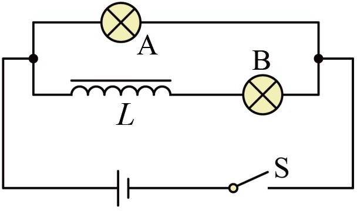{width="2.0380096237970253in"
height="1.2in"}

A.  开关闭合到电路中电流稳定的时间内，*A*
    灯立刻亮，而后逐渐变暗，最后亮度稳定

B.  开关闭合到电路中电流稳定的时间内，*B*
    灯立刻亮，而后逐渐变暗，最后亮度稳定

C.  开关由闭合到断开瞬间，*A* 灯闪亮一下再熄灭

D.  开关由闭合到断开瞬间，电流自左向右通过 *A* 灯

【答案】A

【解析】

【详解】A．开关闭合到电路中电流稳定的时间内，*A*
灯立刻亮，当线圈电流阻碍作用较小后，由闭合电路欧姆定律可知，则总电流增大，灯泡
*A* 两端的电压逐渐减小，则导致 *A*
灯逐渐变暗，当线圈对电流的电感阻碍作用消失时，灯泡亮度稳定。故 A 正确；

B．开关闭合到电路中电流稳定的时间内，随着线圈的电感阻碍逐渐减小，*B*
灯逐渐变亮，当线圈对电流没有阻碍时，灯泡亮度稳定。故 B 错误；

C．开关闭合电路稳定时，通过线圈的电流小于通过灯泡 *A*
的电流；在开关断开瞬间，线圈产生自感电动势提供瞬间电压给两灯泡供电，由于不会出现电流比之前还大的现象，因此
*A* 灯不会闪亮一下，只会一同慢慢熄灭。故 C 错误；

D．在开关断开瞬间，线圈相当于电源，电流方向仍不变，所以电流自右向左通过
*A* 灯，故 D 错误；故选 A。

7.  两个不规则带电导体间的电场线分布如图所示，已知导体附近的电场线均与导体表面垂直，*a*、*b*、*c*、*d*为电场中几个点，并且
    *a*、*d* 为紧靠导体表面的两点，以无穷远为零电势点，则（ ）

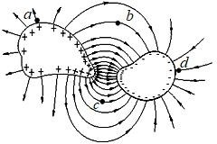{width="2.0089260717410324in"
height="1.3333333333333333in"}

A.  场强大小关系有 *Eb* \> *Ec*

B.  电势大小关系有ϕ*b* \> ϕ*d*

C.  将一负电荷放在 *d* 点时其电势能为负值

D.  将一正电荷由 *a* 点移到 *d* 点的过程中电场力做负功

【答案】B

【解析】

【详解】A．电场线越密的地方，电场强度越大，由图可知 *c* 点的电场线比 *b*
点的更密，所以有 *E~c~* \> *E~b~* ，故 A 错误；

B．沿着电场线，电势逐渐降低，*b* 点所处的电场线位于右侧导体的前面，即
*b* 点的电势比右侧的导体高，

而 *d* 点紧靠右侧导体的表面，电势与导体的电势几乎相等，故 *b* 点电势高于
*d* 点的电势，故 B 正确；

> C．*d* 点处电势为负值，根据 *E*p = *q*ϕ可知负电荷放在 *d*
> 点时其电势能为正值，故 C 错误；

D．从图中可以看出，*a* 点的电势高于 *b* 点的电势，而 *b* 点的电势又高于
*d* 点的电势，所以 *a* 点的电势高于 *d*
点的电势；正电荷在电势高处电势能大，在电势低处电势能小，故正检验电荷从
*a* 点移到 *d* 点的过程中，电势能减小，则电场力做正功，故 D 错误。

故选 B。

# 二、多选题

# 

8.  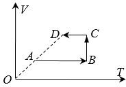{width="1.532127077865267in"
    height="1.0666655730533683in"}封闭在气缸内一定质量的理想气体由状态
    *A* 变到状态 *D*，其体积 *V* 与热力学温度关 *T*
    系如图所示，该气体的摩尔质量为 *M*，状态 *A* 的体积为 *V*0，温度为
    *T*0，*O*、*A*、*D* 三点在同一直线上，阿伏伽德罗常数为 *N*A．由状态
    *A* 变到状态 *D* 过程中（ ）

    A.  气体从外界吸收热量，内能增加

    B.  气体体积增大，单位时间内与器壁单位面积碰撞的分子数增加

    C.  气体温度升高，每个气体分子的动能都会增大

    D.  气体的密度减小

【答案】AD

【解析】

### pV

=

【详解】由题知 *A* 点和 *D* 点在过原点的连线上，根据理想气体状态方程有
*C*

## T

> 变形得*V* = *C T*
>
> *p*
>
> 可知*V* − *T* 图像的斜率表示 *k* = *C* ，可知气体由 *A* 到 *D*
> 压强不变，体积增大，密度减小，单位时间内与器

### p

壁单位面积碰撞的分子数减少，气体对外做功，温度升高，气体的平均动能增加，内能增加，故需要吸热。故选
AD。

9.  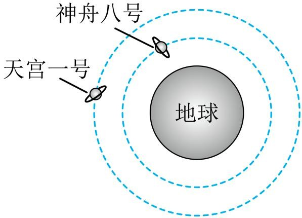{width="2.115in"
    height="1.51in"}2011 年 11 月 3 日 1 时 43
    分，中国自行研制的"神舟八号"飞船与"天宫一号"目标飞行器在距离地球
    343km的轨道上实现自动对接，为未来空间站建设迈出了关键一步。假如"神舟八号"与"天宫一号"的质量相等，对接前它们环绕地球分别做匀速圆周运动的运行轨道如右图所示，则以下说法中正确的是（
    ）

    A.  对接前的向心加速度，"天宫一号"比"神舟八号"大

    B.  对接前的运行周期，"天宫一号"比"神舟八号"大

    C.  对接前的机械能，"天宫一号"比"神舟八号"小

    D.  "神舟八号"需先点火加速才有可能与"天宫一号"实现对接

【答案】BD

【解析】

【详解】A．根据万有引力提供向心力有*G mM*

*r* 2

可知，半径越大向心加速度越小，故 A 错误；

> = *ma*
>
> B．根据万有引力提供向心力有*G mM*

*r* 2

> = *mr*
>
> 4π^2^
>
> *T* 2

可知，半径越大周期越大，故 B 正确；

C．向更高轨道发射相同质量的卫星，轨道越高克服地球做功越多，卫星的机械能越大，因为天宫一号轨道高度大，故其机械能大于神舟八号飞船的机械能，故
C 错误；

D．神舟八号轨道半径比天宫一号低，在轨道上点火加速，使神舟八号做离心运动而抬升轨道完成与天宫一号对接，故
D 正确。

故选 D。

10. 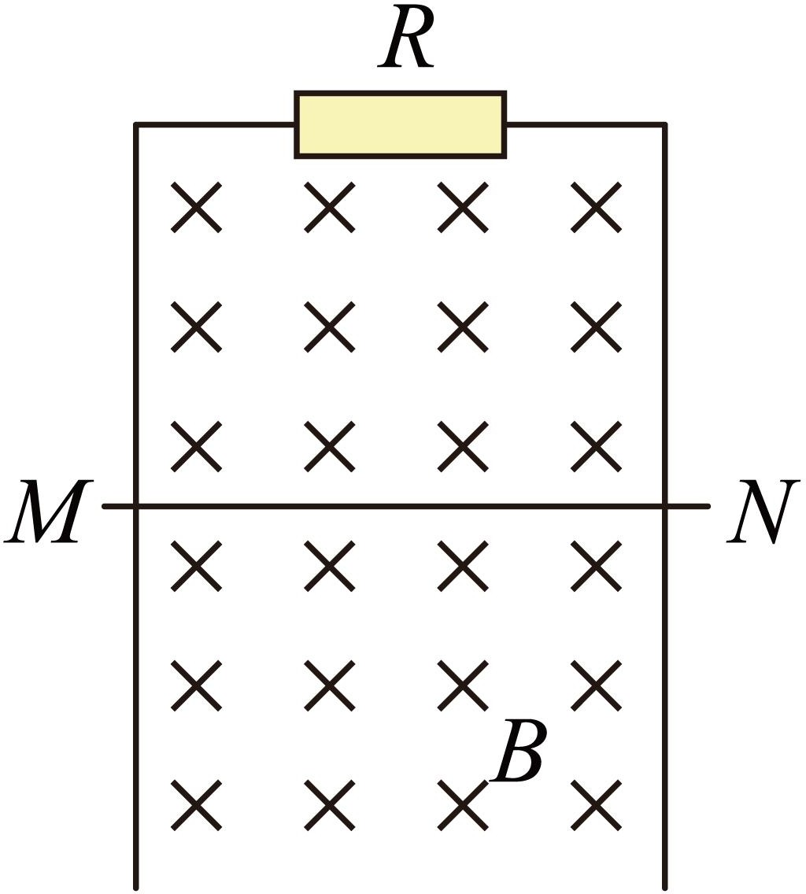{width="1.8299048556430446in"
    height="2.0116666666666667in"}如图所示，导体框位于竖直平面内，匀强磁场垂直于纸面向里，磁感应强度大小
    *B*=2.0T，水平导体棒 *MN*
    可沿两侧足够长的光滑导轨下滑而不分离，导体棒 *MN* 质量
    *m*=0.1kg，接入电路的电阻 *r*=1.0Ω；导轨宽度 *L*=1.0m，定值电阻
    *R*=3.0Ω，装置的其余部分电阻可忽略不计。将导体棒 *MN*
    无初速度释放，导体棒下滑 *h*=2.0m 高度时速度达到最大，重力加速度
    *g*=10m/s^2^。则导体棒（ ）

    A.  下滑的最大速度为 1m/s

    B.  从释放到下滑 *h* 高度所经历时间为 1s

    C.  从释放到下滑 *h* 高度过程中，电阻 *R* 产生的热量为 1.95J

    D.  从释放到下滑 *h* 高度过程中，通过电阻 *R* 的电荷量为 1C

【答案】D

【解析】

> 【详解】A．导体棒速度最大时，安培力等于重力，即 *mg* = *BI*m *L*
>
> 其中 *I* = *E*m = *BLv*m

m

> 联立得*v*m
>
> *R* + *r R* + *r*
>
> = *mg*(*R* + *r*) *B*2 *L*2
>
> 代入数据得*v*m = 1m/s ，故 A 正确；
>
> C．由动能定理可知 *mgh* +*W* = 1 *mv*2 − 0
>
> 安 2 m
>
> 解得*W*安 = −1.5J
>
> 所以全电路电阻上的焦耳热*Q* = −*W*安 = 1.5J
>
> 所以电阻 *R* 上产生的热量*QR* = *R* + *r Q* = 1.125J ，故 C 错误；

*R*

> D．导体下落 *h* 的过程中，通过导线横截面的电量 *q* = *It*
>
> 其中 *I* =

## E

> *R* + *r*
>
> ， *E* = ΔΦ ， Δ*Φ* = *B*Δ*S* = *BLh*
>
> Δ*t*
>
> 联立，解得 *q* = 1C，故 D 正确；
>
> B．导体棒下落 *h* 的过程中，设经历时间为 *t*，根据动量定理得 *mgt* −
> *BILt* = *mv*m − 0
>
> 其中 *q* = *It*
>
> 代入数据解得*t* = 2.1s ，故 B 错误。故选 D。

# 二、实验题

11. 某同学用如图甲所示装置测当地重力加速度．光电门固定在铁架台上，与电子计时器连接，且离铁架台的底座有足够的高度，*a*、*b*
    是两个完全相同的小球，用长为 *L* 的细线连接。

> 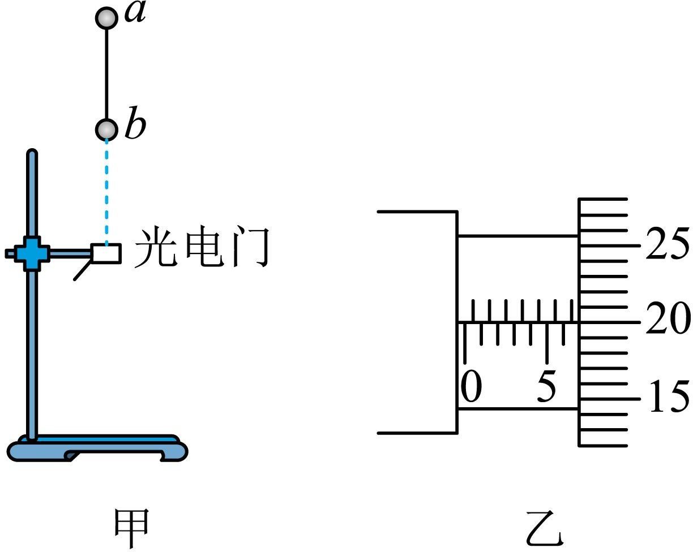{width="2.305936132983377in"
> height="1.83in"}

1.  实验前先用螺旋测微器测出小球的直径，示数如图乙所示，则小球的直径
    *d*＝ mm。

2.  用手提着 *a* 球，使 *b* 球悬吊，两球静止在光电门正上方．由静止释放
    *a* 球，光电计时器记录 *b* 球和 *a*

> 球通过光电门时的遮光时间分别为*t*~1~ 、*t*~2~ ，则 *b*
> 球通过光电门时，*a* 球的速度大小为*v*1 = ，当地的重
>
> 力加速度 *g*＝ （用*t*~1~ 、*t*~2~ 、*d*、*L* 表示）。

### d

# *d* ^2^  1 − 1 

# 

> 【答案】①. 6.700/6.701/6.699 ②. *t* ③. 2( *L* + *d* )  *t*2 *t*2 
>
> 1  2 1 

12. 为了研究某导线的特性，某同学所做部分实验如下：

{width="5.725074365704287in"
height="1.88in"}

(1) 用螺旋测微器测出待测导线的直径，如图甲所示，则螺旋测微器的读数为
    mm；

(2) 用多用电表直接测量一段导线的阻值，选用"×10"倍率的电阻挡测量，发现指针偏转角度太大，因此需选择
    倍率的电阻挡（选填"×1"或"×100"），欧姆调零后再进行测量，示数如图乙所示，则测量值为

Ω；

(3) 另取一段同样材料的导线，进一步研究该材料的特性，得到电阻 *R* 随电压
    *U* 变化图像如图丙所示，则由图像可知，该材料在常温时的电阻为
    Ω；当所加电压为 3.00V 时，材料实际消耗的电功率为

W．（结果保留两位有效数字）

【答案】 ①. 1.731（1.730---1.733） ②. ×1 ③. 22 ④. 1.5 ⑤.
0.78（0.70---0.80 均给分）

【解析】

【详解】(1)\[1\]由图可知，螺旋测微器的示数为：*d*=1.5+23.0×0.01mm=1.730mm；
(2)\[2\]角度偏转太大，则说明示数太小，阻值太小，应换用小倍率挡位，故选用×1
挡； \[3\]由图可知，电阻值为：22×1=22Ω；

(3)\[4\]由图可知，常温不加电压时，电阻为 1.5Ω；

\[5\]加电压为 3V 时，电阻为 11.5Ω；则功率：

> *U* 2

*P* = =

## R

> 32

# 11.5

> W ≈ 0.78W

## L

## 

13. 轻质细线吊着一边长为 *L*＝0.8 m、匝数 *n*＝10 的正方形线圈，总电阻为
    *r*＝1 Ω.边长为

# 2

的正方形磁场

区域对称分布在线圈下边的两侧，如图甲所示，磁场方向垂直纸面向里，大小随时间变化关系为：*B*=1+0.5*t*

（如图乙所示），2s 时细线开始松弛，取 *g*＝10 m/s^2^.求：

1.  刚开始时线圈产生的电动势 *E* 大小及电流方向；

（2）2s 内通过线圈的电荷量 *q*；

3.  线圈质量 *m*．

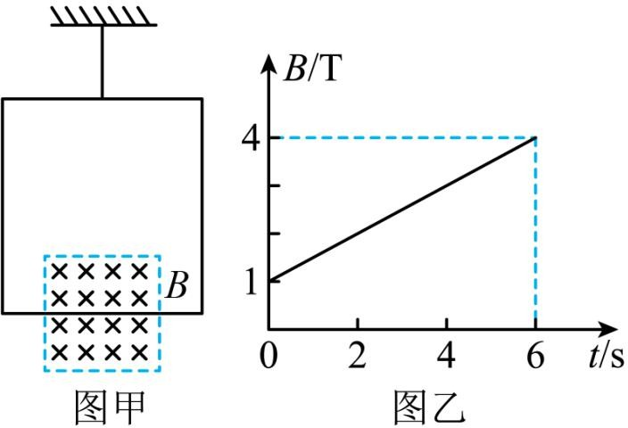{width="2.3600153105861765in"
height="1.6in"}

【答案】（1）0.4V 逆时针 （2）0.8C （3）0.32kg

【解析】

【详解】（1）由法拉第电磁感应定律：

# ∆Φ ∆*B*

> 1  *L* 2
>
> *E* = *n* ∆*t* = *n* ∆*t S* ，其中 *S* = 2  2 

 

解得：*E*＝0.4 V

感应电流的方向：逆时针。

2.  *I* =
    {width="0.1351246719160105in"
    height="6.930227471566054e-3in"} = 0.4 A，则 2s 内通过线圈的电荷量
    *q=It*=0.8C。

*E*

### r

3.  分析线圈受力可知，当细线松弛时有：

*t*=2s 时，*B*=2T解得：*m*=0.32kg

> *F* = *nBI L* = *mg*
>
> 安 2

*I* = *E*

### r

### 

14. 为了研究过山车的原理，某物理小组提出了下列的设想：取一个与水平方向夹角为*θ*＝60°，长为*L*1＝2

> 3

m 的倾斜轨道 *AB*，通过微小圆弧与长为 *L*2＝ 3 m 的水平轨道 *BC*
相连，然后在 *C* 处设计一个竖直完整的

# 2

光滑圆轨道，出口为水平轨道 *D*，如图所示。现将一个小球从距 *A* 点高为
*h*＝0.9 m 的水平台面上以一定的初速度 *v*0 水平弹出，到 *A*
点时速度方向恰沿 *AB* 方向，并沿倾斜轨道滑下。已知小球与 *AB* 和 *BC*
间的动摩

> 擦因数均为*μ*＝ 3 。*g* 取 10 m/s2，求：

# 3

(1) 小球初速度 v0 的大小；

(2) 小球滑过 *C* 点时的速率 *v*C；

(3) 要使小球不离开轨道，则竖直圆弧轨道的半径 *R* 应该满足什么条件。

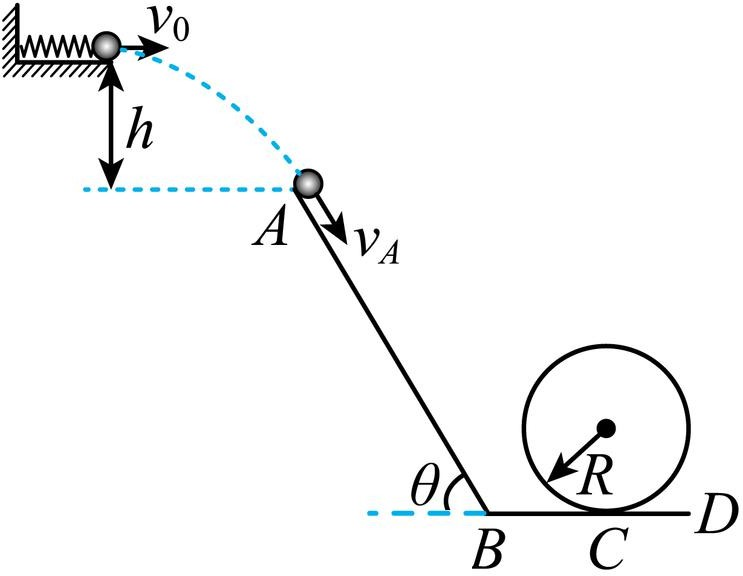{width="2.2581791338582677in"
height="1.7399989063867016in"}

【答案】(1)

> 6
>
> m/s；(2)3
>
> m/s；(3)0＜*R*≤1.08 m

【解析】

> 6

【详解】(1)小球做平抛运动到达 *A* 点，由平抛运动规律知竖直方向有

> *v*^2^ = 2*gh*

*y*

即

*vy*＝3 m/s

> 2
>
> 因为在 *A* 点的速度恰好沿 *AB* 方向，

所以小球初速度

> *v*0 = *vy* tan 30° =

# {width="0.19599956255468068in" height="0.17969378827646545in"}6m/s

# 

(2) 从水平抛出到 *C* 点的过程中，由动能定理得

> *mg*(*h* + *L* sinθ)-μ*mgL* cosθ−μ*mgL* = 1 *mv*2 − 1 *mv*2
>
> 1 1 2 2 *C* 2 0

解得

{width="0.1953193350831146in"
height="0.17923556430446194in"}*vC* = 3 6m/s

(3) 小球刚好能通过最高点时，由牛顿第二定律有

> *mg* = *m v*

2

> *R*1

小球做圆周运动过程中，由动能定理有

解得

> −2*mgR*1
>
> = 1 *mv*2 − 1 *mv*2

# 2 2 *C*

# 

*v*2

*R* = *[C]{.underline}*

1 5*g*

#  = 1.08m

# 

当小球刚好能到达与圆心等高时有

解得

> *mgR*2
>
> = 1 *mv*2
>
> 2 *C*
>
> *v*2 *R*2 = *[C]{.underline}*

2*g*

#  = 2.7 m

# 

> 当圆轨道与 *AB* 相切时

# *R*~3~ = *L*~2~ tan 60° = 1.5 m

即圆轨道的半径不能超过 1.5 m，综上所述，要使小球不离开轨道，*R*
应该满足的条件是

# 0 \< *R* ≤ 1.08 m

15. 如图甲为研究电磁感应的实验装置示意图，其中电流传感器（电阻不计）能将各时刻的电流数据实时通过数据采集器传输给计算机，经计算机处理后在屏幕上同步显示出
    *I*---*t*
    图像。平行且足够长的光滑金属轨道的电阻忽略不计，左侧倾斜导轨平面与水平方向夹角*θ
    =* 37°，与右侧水平导轨平滑连接，轨道上端连接 一阻值 *R =*
    0.5Ω的定值电阻，金属杆 *MN* 的电阻 *r =* 0.5Ω，质量 *m =* 1kg，杆长
    *L =* 1m 跨接在两导轨上。
    左侧倾斜导轨区域加一垂直轨道平面向下的匀强磁场；右侧水平导轨区域也加一垂直轨道平面向下的匀强磁场，磁感应强度大小都为
    *B =* 1.0T，让金属杆 *MN*
    从图示位置由静止释放，其始终与轨道垂直且接触良好，金属棒经过倾斜轨道与水平轨道连接处无能量损失，此后计算机屏幕上显示出金属杆在倾斜导轨上滑行过程中的
    *I*---*t* 图像，如图乙所示，*g* 取 10m/s^2^，sin37^o^ *=* 0.6，求：

<!-- -->

(1) 金属杆 *MN* 在倾斜导轨上滑行的最大速率；

(2) 金属杆 *MN* 在水平导轨上滑行过程中克服安培力做的总功；

(3) 根据计算机上显示的 *I*---*t* 图像可知，当 *t =* 0.5s 时 *I =*
    2A，此时 MN 在斜面上运动的距离为 1m，求 0 \~ 0.5s

内在电阻 *R* 上产生的焦耳热。

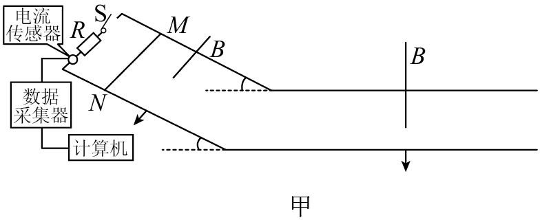{width="4.979646762904637in"
height="2.033333333333333in"}

> 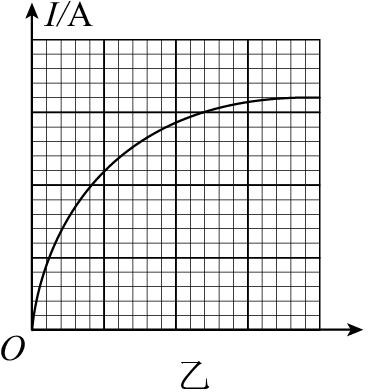{width="2.1901017060367454in"
> height="2.3275in"}

【答案】(1)6m/s；(2)18J；(3)2J

【解析】

【分析】

【详解】(1)由 *I*---*t*
图象可知，当金属杆到达斜面低端时，已经达到最大速率匀速运动，由平衡条件得

> *mg*sin*θ = BIL*

感应电动势

> *E = BLvm = I*(*R* + *r*)

代入数据解得

> *vm =* 6m/s

(2) 金属杆 *MN* 在水平导轨上滑行过程中，由动能定理可得

\- *W =* 0 - 1 *mv* 2

> 安 2 *m*

代入数据解得

*W* 安 *=* 18J

(3) 由题 *t =* 0.5s 时 *I =* 2A，依据闭合电路欧姆定律，有

*I* = *E*

> = *BLv*
>
> *R* + *r R* + *r*

代入数据解得

> *v =* 2m/s
>
> 已知 *x =* 1.0m

由功能关系可得

代入数据解得

> *mgx* sinθ= 1 *mv*^2^ + *Q*

# 2

# 

> *Q =* 4J

则

*QR* =

## R Q

> *R* + *r*
>
> *=* 2J
